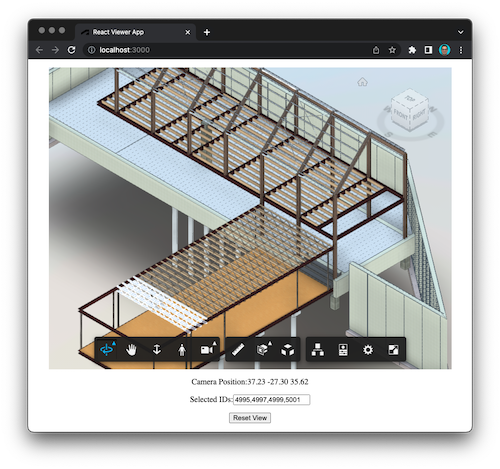

# Viewer React Sample

> This code sample is referenced by the following blog post: https://aps.autodesk.com/blog/building-simple-react-wrapper-viewer

Simple React application (bootstrapped using [Create React App](https://github.com/facebook/create-react-app)) with the viewer embedded into it using a custom wrapper component.

## Development

### Prerequisites

- [Node.js](https://nodejs.org)
- Terminal (for example, [Windows Command Prompt](https://en.wikipedia.org/wiki/Cmd.exe) or [macOS Terminal](https://support.apple.com/guide/terminal/welcome/mac))
- To keep things simple, this application does not use any server code - you'll need to hard-code an access token and a model URN directly into the client-side code
    - If you don't know how to get these values, try the following:
        - Go to https://aps-universal-test-app.autodesk.io/api/token and copy the value of the `access_token` property
        - Go to https://aps-universal-test-app.autodesk.io/api/models and copy the `urn` of one of the models

### Running

- Clone this repository, and navigate to the repo folder in terminal
- Install dependencies: `npm install`
- Go to _src/index.jsx_, and update the `APS_ACCESS_TOKEN` and `APS_MODEL_URN` constants with your access token and model URN
- Run `npm start` to open the application in development mode
    - The app should automatically open in your browser (if not, navigate to [http://localhost:3000](http://localhost:3000))
    - When you make any changes to the code, the page will automatically reload

## Troubleshooting

Please contact us via https://aps.autodesk.com/en/support/get-help.

## License

This sample is licensed under the terms of the [MIT License](http://opensource.org/licenses/MIT). Please see the [LICENSE](LICENSE) file for more details.
